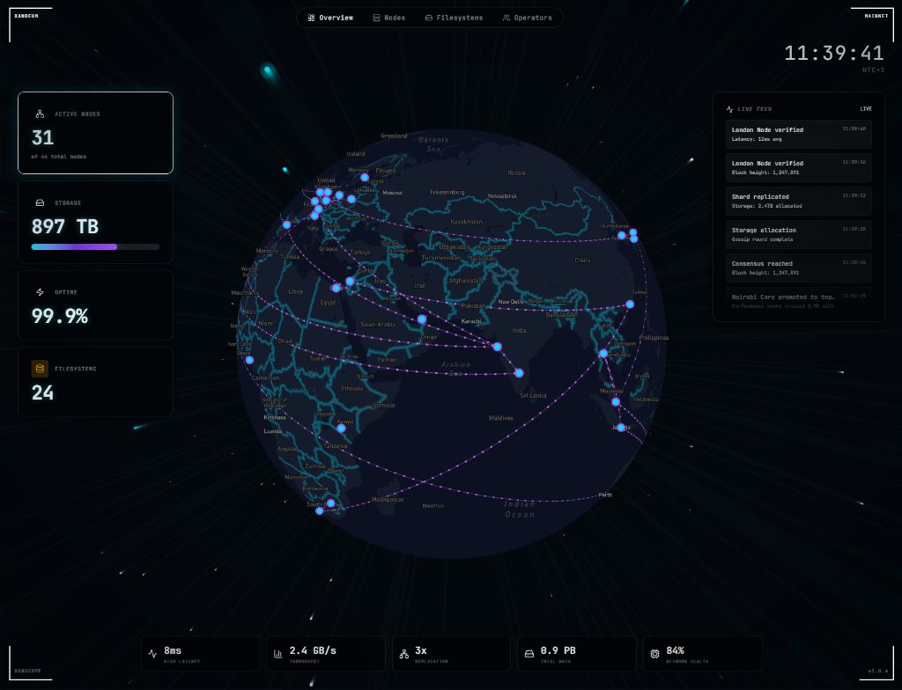

# XanScope

**Premium Analytics Platform for Xandeum pNodes**

XanScope is a web-based analytics dashboard for monitoring and managing [Xandeum](https://xandeum.network) storage provider nodes (pNodes). It provides real-time insights into network health, node performance, and filesystem operations.



---

## ✨ Features

### Dashboard
- **Network Overview** — Live stats: total nodes, online/offline counts, storage capacity
- **Interactive Globe** — Mapbox-powered 3D globe showing global pNode distribution
- **Activity Feed** — Real-time stream of network events
- **Leaderboard** — Top performing nodes by uptime and reliability

### Nodes Explorer
- **Searchable Grid** — Filter by region, status, version, provider
- **Node Detail Pages** — Deep-dive into individual node metrics
- **Performance History** — Timeline charts for each node

### Filesystem Analytics
- **FS Summaries** — Overview of all registered filesystems
- **Tree Browser** — Navigate directory structures
- **Operations Log** — Track recent file operations (peek, poke, etc.)

> *Note: Filesystem data currently uses demo content — awaiting Xandeum chain indexer for live integration.*

### Operators Dashboard
- **My Nodes** — Personal watchlist stored in localStorage
- **Quick Stats** — Aggregated metrics for tracked nodes
- **Add Nodes** — Select and monitor specific pNodes

---

## 🏗️ Architecture

XanScope uses a **Dual-Client Architecture** to support both development (mock data) and production (live pRPC) modes:

```
┌─────────────────────────────────────────────────────────────┐
│                      data-service.ts                         │
│                                                              │
│   ┌─────────────────┐         ┌─────────────────┐           │
│   │  shouldUseMock  │────────▶│   Mock Data     │           │
│   │     = true      │         │  mock-data.ts   │           │
│   └─────────────────┘         └─────────────────┘           │
│           │                                                  │
│           ▼ (when PRPC_ENDPOINT is set)                     │
│   ┌─────────────────┐         ┌─────────────────┐           │
│   │   prpc-client   │────────▶│  pNode RPC      │ Port 6000 │
│   │  get-pods       │         │  (JSON-RPC 2.0) │           │
│   │  get-stats      │         └─────────────────┘           │
│   │  get-version    │                                        │
│   └─────────────────┘                                        │
│                                                              │
│   ┌─────────────────┐         ┌─────────────────┐           │
│   │ xandeum-client  │────────▶│  Solana RPC     │ Port 8899 │
│   │  listDirs       │         │  (Xandeum ext.) │           │
│   │  getMetadata    │         └─────────────────┘           │
│   │  exists         │                                        │
│   └─────────────────┘                                        │
└─────────────────────────────────────────────────────────────┘
```

### Data Sources

| Client | Endpoint | Purpose |
|--------|----------|---------|
| `prpc-client.ts` | `http://<pnode>:6000/rpc` | Node health, peers, stats |
| `xandeum-client.ts` | `https://api.devnet.solana.com` | Filesystem operations |

---

## 🚀 Quick Start

### Prerequisites

- Node.js 18+ 
- npm or pnpm
- Mapbox account (for globe visualization)

### Installation

```bash
# Clone the repository
git clone https://github.com/AngryPacifist/xanscope.git
cd xanscope

# Install dependencies
npm install

# Run development server
npm run dev
```

Open [http://localhost:3000](http://localhost:3000) to view the dashboard.

---

## ⚙️ Environment Variables

Create a `.env.local` file in the project root:

```env
# Mapbox (Required for globe)
NEXT_PUBLIC_MAPBOX_TOKEN=pk.eyJ1...your_mapbox_token

# pNode RPC Connection (Optional - uses mock data if not set)
PRPC_ENDPOINT=http://<pnode-ip>:6000/rpc

# Xandeum/Solana RPC (Optional)
NEXT_PUBLIC_SOLANA_RPC=https://api.devnet.solana.com

# Toggle mock data (defaults to true if PRPC_ENDPOINT not set)
NEXT_PUBLIC_USE_MOCK_DATA=false
```

### Mock Data Mode

By default, XanScope runs with **mock data** enabled. This allows you to:
- Develop and test the UI without a live pNode
- Demo the platform without network dependencies
- Randomized node statuses on each refresh simulate real network activity

### Live Mode

To connect to a real pNode:
1. Set `PRPC_ENDPOINT` to your pNode's RPC URL
2. Set `NEXT_PUBLIC_USE_MOCK_DATA=false`
3. Restart the dev server

---

## 📁 Project Structure

```
xanscope/
├── app/                    # Next.js App Router pages
│   ├── page.tsx            # Dashboard home
│   ├── nodes/              # Nodes explorer + detail pages
│   ├── fs/                 # Filesystem analytics
│   ├── operators/          # Personal operator dashboard
│   ├── network/            # Network-wide stats
│   └── insights/           # Analytics & charts
├── components/
│   ├── ui/                 # Base UI primitives (Card, Button, etc.)
│   ├── layout/             # Header, sidebar, navigation
│   ├── visuals/            # Globe, charts, animations
│   ├── nodes/              # Node-specific components
│   └── fs/                 # Filesystem components
├── lib/
│   ├── data-service.ts     # Data aggregation layer
│   ├── prpc-client.ts      # pNode RPC client
│   ├── xandeum-client.ts   # Solana/Xandeum RPC client
│   ├── mock-data.ts        # Development mock data
│   └── types.ts            # TypeScript interfaces
└── public/
    ├── Brief.md            # Bounty requirements
    ├── XANDEUM API.md      # API documentation
    └── XANDEUM.md          # Xandeum overview
```

---

## 🛠️ Tech Stack

| Category | Technology |
|----------|------------|
| Framework | Next.js 15, React 19 |
| Styling | Tailwind CSS v4 |
| Globe | Mapbox GL JS |
| Animations | CSS + Framer Motion |
| Icons | Lucide React |
| State | React hooks + localStorage |

---

## 🔌 pRPC API Reference

XanScope consumes these pNode RPC methods:

### `get-version`
Returns the pNode software version.
```json
{ "jsonrpc": "2.0", "method": "get-version", "id": 1 }
// Response: { "result": { "version": "0.7.0" } }
```

### `get-stats`
Returns comprehensive node statistics.
```json
{ "jsonrpc": "2.0", "method": "get-stats", "id": 1 }
// Response: { "result": { "metadata": {...}, "stats": {...}, "file_size": 1048576 } }
```

### `get-pods`
Returns all known peer pNodes in the network.
```json
{ "jsonrpc": "2.0", "method": "get-pods", "id": 1 }
// Response: { "result": { "pods": [...], "total_count": 42 } }
```

---

## 📦 Deployment

### Vercel (Recommended)

```bash
# Install Vercel CLI
npm i -g vercel

# Deploy
vercel
```

Set environment variables in Vercel dashboard.

### Docker

```bash
docker build -t xanscope .
docker run -p 3000:3000 xanscope
```

---

## 🧪 Development

```bash
# Run dev server
npm run dev

# Type check
npm run lint

# Build for production
npm run build

# Start production server
npm start
```

---

## 📋 Bounty Submission

This project was built for the **Xandeum pNode Analytics Platform Bounty**.

### Requirements Met

| Requirement | Status |
|-------------|--------|
| Web-based analytics platform | ✅ |
| Retrieve pNodes via pRPC | ✅ |
| Display pNode information | ✅ |
| Accessible and usable | ✅ |
| Deployment documentation | ✅ |

### Innovation Highlights

- 🌍 **Interactive 3D Globe** — Real-time node visualization
- 🎨 **Premium Dark Aesthetic** — Inspired by Xandeum branding
- 📊 **Operators Dashboard** — Personal node watchlist
- 🔄 **Dual Architecture** — Seamless mock ↔ production toggle

---

## 📄 License

MIT License — see [LICENSE](LICENSE) for details.

---

## 🔗 Links

- [Xandeum Network](https://xandeum.network)
- [Xandeum Docs](https://docs.xandeum.network)
- [Xandeum Discord](https://discord.gg/uqRSmmM5m)
- [pNode Setup Guide](https://docs.xandeum.network/operator-guides)
