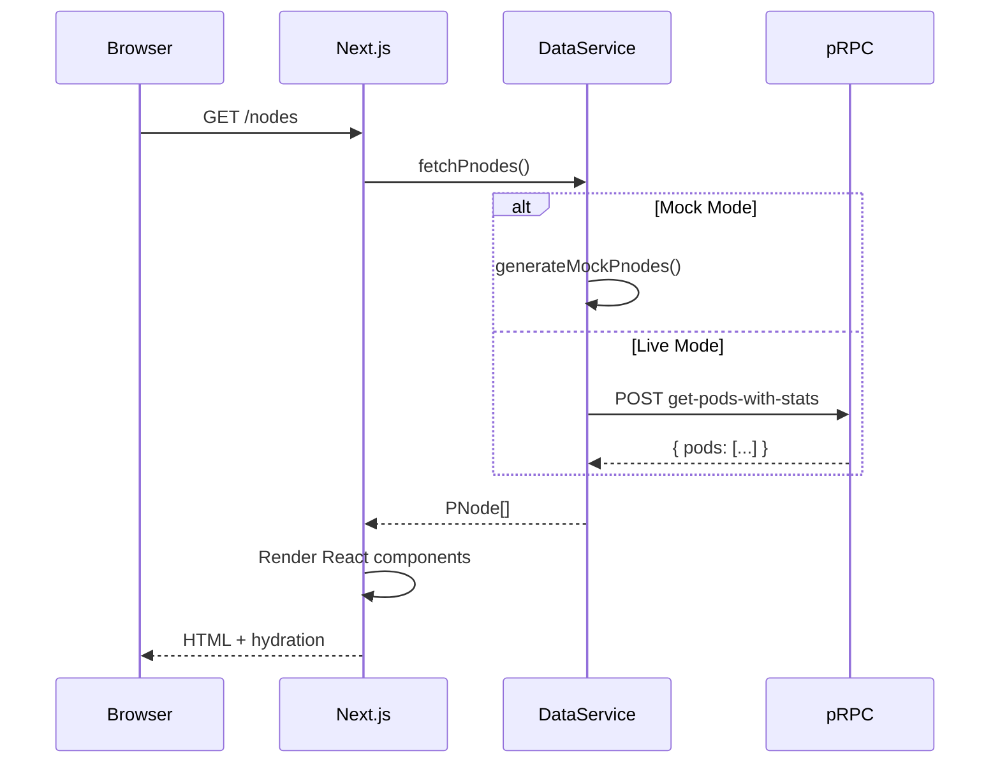

# Architecture Overview

This document explains XanScope's system design, data flow, and key architectural decisions.

## System Diagram

```
┌─────────────────────────────────────────────────────────────────────────┐
│                           XanScope (Next.js 15)                          │
├─────────────────────────────────────────────────────────────────────────┤
│                                                                          │
│  ┌─────────────────────────────────────────────────────────────────┐    │
│  │                         App Router Pages                          │    │
│  │  ┌─────────┐ ┌─────────┐ ┌─────────┐ ┌─────────┐ ┌─────────┐    │    │
│  │  │Dashboard│ │  Nodes  │ │Operators│ │   FS    │ │Insights │    │    │
│  │  │ page.tsx│ │page.tsx │ │page.tsx │ │page.tsx │ │page.tsx │    │    │
│  │  └────┬────┘ └────┬────┘ └────┬────┘ └────┬────┘ └────┬────┘    │    │
│  └───────┼──────────┼──────────┼──────────┼──────────┼─────────────┘    │
│          └──────────┴──────────┴──────────┴──────────┘                  │
│                                    │                                     │
│  ┌─────────────────────────────────▼───────────────────────────────┐    │
│  │                      data-service.ts                              │    │
│  │    ┌─────────────────────────────────────────────────────────┐   │    │
│  │    │ shouldUseMock = !PRPC_ENDPOINT || USE_MOCK_DATA=true    │   │    │
│  │    └─────────────────────────────────────────────────────────┘   │    │
│  │                      │                    │                       │    │
│  │           ┌──────────▼──────────┐  ┌─────▼─────────────┐         │    │
│  │           │   mock-data.ts      │  │   prpc-client.ts  │         │    │
│  │           │  (Mock Generators)  │  │   (Real pRPC)     │         │    │
│  │           └─────────────────────┘  └─────────┬─────────┘         │    │
│  └──────────────────────────────────────────────┼───────────────────┘    │
│                                                 │                        │
└─────────────────────────────────────────────────┼────────────────────────┘
                                                  │
                                    ┌─────────────▼─────────────┐
                                    │      pNode (Xandeum)       │
                                    │  ┌─────────────────────┐   │
                                    │  │  pRPC API :6000     │   │
                                    │  │  - get-version      │   │
                                    │  │  - get-stats        │   │
                                    │  │  - get-pods         │   │
                                    │  │  - get-pods-with-stats│ │
                                    │  └─────────────────────┘   │
                                    └────────────────────────────┘
```

## Key Design Decisions

### 1. Dual-Mode Architecture

XanScope supports both mock and live data modes through a single abstraction layer:

```typescript
// lib/data-service.ts
const shouldUseMock =
  process.env.NEXT_PUBLIC_USE_MOCK_DATA !== "false" ||
  !process.env.PRPC_ENDPOINT;

export async function fetchPnodes() {
  if (shouldUseMock) {
    return generateMockPnodes(); // Random data each call
  }
  return prpcClient.getPodsWithStats(); // Real network data
}
```

**Benefits:**
- Seamless development without network dependencies
- Easy demo mode for presentations
- Single codebase for both modes

### 2. Server-Side Data Fetching

All pRPC calls happen on the server (React Server Components):

```
Browser → Next.js Server → pRPC Endpoint → pNode
```

**Benefits:**
- pRPC endpoint never exposed to client
- CORS is not an issue
- Sensitive env vars stay on server

### 3. Component Architecture

```
components/
├── ui/                 # Base primitives
│   ├── holographic-card.tsx
│   ├── status-pill.tsx
│   └── metric-value.tsx
├── layout/             # App chrome
│   ├── site-header.tsx
│   └── mobile-nav.tsx
├── visuals/            # Data viz
│   ├── globe.tsx
│   └── activity-chart.tsx
├── nodes/              # Domain-specific
│   ├── nodes-client.tsx
│   └── node-detail-client.tsx
└── fs/                 # Filesystem features
    └── filesystems-client.tsx
```

### 4. Client/Server Split

| Component Type | Rendering | Why |
|----------------|-----------|-----|
| Pages (page.tsx) | Server | Data fetching |
| Interactive UI (*-client.tsx) | Client | useState, onClick |
| Static UI | Server | Performance |

## Data Flow

### 1. Initial Page Load



### 2. Data Caching

XanScope implements a simple in-memory cache for pRPC responses:

```typescript
let cachedPods: PodsCacheEntry | null = null;

async function getPodsWithStatsFromCache() {
  const now = Date.now();
  
  if (cachedPods && now - cachedPods.timestamp < CACHE_TTL) {
    return cachedPods.data;
  }
  
  const freshData = await prpcClient.getPodsWithStats();
  cachedPods = { data: freshData, timestamp: now };
  return freshData;
}
```

**Cache TTL: 30 seconds** — balances freshness with pRPC load.

## File Structure

```
xanscope/
├── app/                    # Next.js App Router
│   ├── layout.tsx          # Root layout with header
│   ├── page.tsx            # Dashboard (/)
│   ├── nodes/
│   │   ├── page.tsx        # Nodes grid (/nodes)
│   │   └── [id]/page.tsx   # Node detail (/nodes/:id)
│   ├── fs/page.tsx         # Filesystems (/fs)
│   ├── operators/page.tsx  # Operators (/operators)
│   └── globals.css         # Tailwind base styles
│
├── components/
│   ├── ui/                 # Reusable UI primitives
│   ├── layout/             # Header, navigation
│   ├── visuals/            # Charts, globe, animations
│   ├── nodes/              # Node-specific components
│   └── fs/                 # Filesystem components
│
├── lib/
│   ├── data-service.ts     # Data abstraction layer
│   ├── prpc-client.ts      # pNode RPC client
│   ├── xandeum-client.ts   # Solana/Xandeum RPC client
│   ├── mock-data.ts        # Mock data generators
│   ├── types.ts            # TypeScript interfaces
│   └── utils.ts            # Helper functions
│
├── docs/                   # Documentation (you are here)
│
└── public/
    ├── Brief.md            # Hackathon requirements
    ├── XANDEUM.md          # Xandeum overview
    └── XANDEUM API.md      # API documentation
```

## Type System

XanScope uses TypeScript throughout. Key interfaces:

```typescript
// Canonical pNode representation
interface PNode {
  id: string;
  label: string;
  address: string;
  region: string;
  country: string;
  provider: string;
  version: string;
  release: string;
  storageTb: number;
  performanceScore: number;
  uptimePercentage: number;
  lastHeartbeat: string;
  status: "online" | "syncing" | "offline";
  latitude: number;
  longitude: number;
}

// pRPC response (raw from pNode)
interface PrpcPeerWithStats {
  address: string;
  is_public: boolean;
  last_seen_timestamp: number;
  pubkey: string;
  rpc_port: number;
  storage_committed: number;
  storage_usage_percent: number;
  storage_used: number;
  uptime: number;
  version: string;
}
```

The `data-service.ts` layer transforms raw pRPC data into the canonical `PNode` format used by UI components.

## Performance Considerations

1. **React Server Components** — Reduce client JS bundle
2. **Response Caching** — 30s TTL on pRPC responses
3. **Static Assets** — Served from Vercel CDN
4. **Lazy Loading** — Mapbox GL only loaded when needed

## Future Enhancements

- [ ] WebSocket subscriptions for real-time updates
- [ ] GeoIP lookup for accurate node locations
- [ ] Historical data storage with TimescaleDB
- [ ] Multi-pNode aggregation
